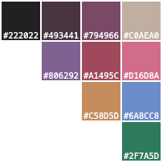

# gruvball theme

[](https://marketplace.visualstudio.com/items?itemName=mrwilford.theme-gruvball) [](https://marketplace.visualstudio.com/items?itemName=mrwilford.theme-gruvball) [](https://marketplace.visualstudio.com/items?itemName=mrwilford.theme-gruvball) [](https://github.com/mrwilford/gruvball)

✓ Dark theme for Visual Studio Code.<br />
✓ Low contrast and easy on the eyes.<br />
✓ Works with [all languages built-in to vscode](https://blogs.msdn.microsoft.com/user_ed/2015/10/24/what-languages-are-supported-for-visual-studio-code/).<br />
✓ Color palette rooted in deep purples and reds.<br />




## Make Changes
After installing gruvball you can modify it with the `workbench.colorCustomizations` setting in your "settings.json" file. For example:

```
"workbench.colorCustomizations":{
  "foreground": "#c0aea0",
  "gitDecoration.ignoredResourceForeground": "#794966",
  "activityBar.foreground": "#c0aea0",
},
```

See the [VS Code Theme Color Reference](https://code.visualstudio.com/docs/getstarted/theme-color-reference) for more information.

## Screenshot
Dart code example:


## Changelog
See [CHANGELOG.md](https://github.com/mrwilford/gruvball/blob/master/CHANGELOG.md)

[atom-grammer-url]: https://marketplace.visualstudio.com/items?itemName=ms-vscode.js-atom-grammar


## Contributors
[](https://github.com/mrwilford)
