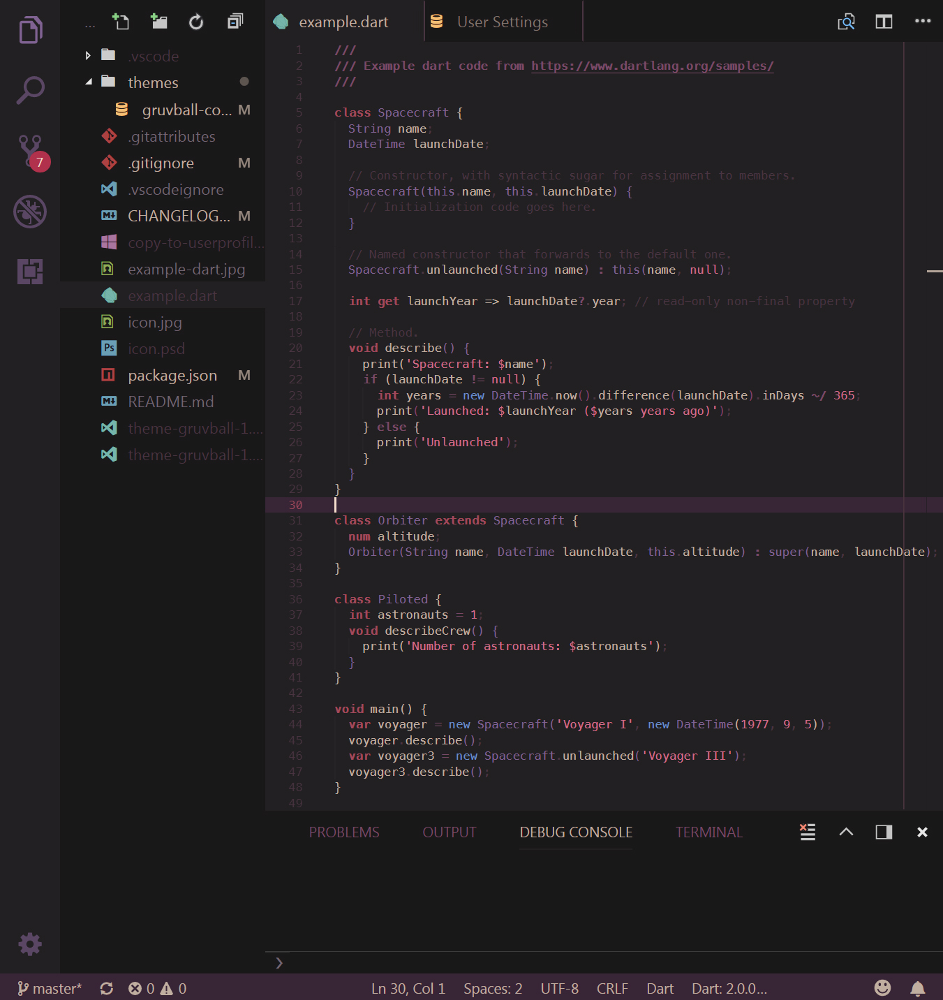

# gruvball theme

gruvball dark theme for Visual Studio Code

[](https://marketplace.visualstudio.com/items?itemName=mrwilford.theme-gruvball) [](https://marketplace.visualstudio.com/items?itemName=mrwilford.theme-gruvball) [](https://marketplace.visualstudio.com/items?itemName=mrwilford.theme-gruvball) [](https://github.com/mrwilford/gruvball)


## Install

press `ctl/command + shift + p` to launch the command palette then run
```
ext install theme-gruvball
```

## Screenshot
Screenshot of Dart




## Changelog
You can take a look at the change log [here](https://github.com/mrwilford/gruvball/blob/master/CHANGELOG.md)

[atom-grammer-url]: https://marketplace.visualstudio.com/items?itemName=ms-vscode.js-atom-grammar
